# GMX CCXT Middleware

[](https://github.com/tradingstrategy-ai/gmx-ccxt-middleware/actions/workflows/acceptance-smoke.yml)

## Introduction

`gmx-ccxt-middleware` provides a REST bridge for GMX, a decentralised perpetual futures exchange that does not ship with a native HTTP API.

This repository combines three pieces:

- the existing Python GMX CCXT-compatible implementation from `web3-ethereum-defi`
- a FastAPI server that exposes that Python exchange over HTTP
- a new `gmx` exchange in the `ccxt` TypeScript source tree that forwards CCXT calls to the bridge

The result is a server-owned deployment model where RPC settings, wallet address, and private keys stay on the Python side, while the CCXT adapter can be compiled from TypeScript to JavaScript, Python, PHP, and the rest of the CCXT target languages.

If you are familiar with the `gmx-ccxt-freqtrade` tutorial repository, this project sits one layer lower in the stack: instead of wiring GMX directly into a Python trading bot, it turns the existing Python GMX adapter into a reusable HTTP service and a remote CCXT exchange.

The server image is published to GitHub Container Registry:

- `ghcr.io/tradingstrategy-ai/gmx-ccxt-middleware:latest`
- `ghcr.io/tradingstrategy-ai/gmx-ccxt-middleware:vN`
- `ghcr.io/tradingstrategy-ai/gmx-ccxt-middleware:main`

For configuration, development, architecture, and tests, see [configuration.md](docs/config.md), [development.md](docs/development.md), [architecture.md](docs/architecture.md), and [tests.md](docs/tests.md).

## Benefits

- GMX becomes accessible through a normal HTTP service even though the exchange itself is on-chain and RPC-driven
- Private keys stay on the server side instead of being distributed to every CCXT client
- The project reuses the mature Python GMX adapter instead of re-implementing GMX logic in each language
- The `ccxt/ts/src/gmx.ts` adapter follows CCXT conventions and can be transpiled through the normal CCXT build flow
- The bridge is easier to operate in controlled environments, including local forks, bots, and internal services
- Testing is cleaner because read-heavy flows can run against Anvil forks, while live smoke checks remain opt-in



For the full breakdown, sequence diagrams, and external integration notes, see [architecture.md](docs/architecture.md).

## Run with Docker

Set the environment variables you need, then start the published container with Docker Compose.

```bash
export GMX_PRIVATE_KEY="0xyourmainnetprivatekey"
export GMX_AUTH_TOKEN="change-me"

docker compose pull
docker compose up -d
```

The bundled [docker-compose.yaml](docker-compose.yaml) already lists every supported runtime environment variable with a short comment explaining what it does. `GMX_RPC_URL` is optional there and defaults to the public Arbitrum RPC. `GMX_EXECUTION_BUFFER` is also optional and defaults to the safe built-in value `2.2`. The published Docker setup listens on `127.0.0.1:8000` by default.

`docker-compose.yaml` tracks `ghcr.io/tradingstrategy-ai/gmx-ccxt-middleware:latest`. The `latest` tag is updated automatically whenever a new numbered release tag such as `v1`, `v2`, or `v3` is published.

The bridge exposes:

- `GET /ping` in [ping.py](src/gmx_ccxt_server/routes/ping.py)
- `GET /describe` in [describe.py](src/gmx_ccxt_server/routes/describe.py)
- `POST /call` in [call.py](src/gmx_ccxt_server/routes/call.py)

Example health check:

```bash
curl \
  -H "Authorization: Bearer ${GMX_AUTH_TOKEN}" \
  http://127.0.0.1:8000/ping
```

## JavaScript Example

Warning: the example below places a real GMX trade with the configured wallet. It first checks that the wallet has enough ETH for gas and enough USDC collateral, then opens and closes a small ETH long so the wallet is returned to flat exposure afterwards.

The full runnable file is [docs/example.js](docs/example.js). Run it with:

```bash
BRIDGE_URL="http://127.0.0.1:8000" \
BRIDGE_TOKEN="${GMX_AUTH_TOKEN}" \
node docs/example.js
```

The example uses an `adapterPath` lookup instead of importing `ccxt` from npm. That is intentional: this repository carries a custom generated `gmx` adapter in `ccxt/js/src/gmx.js`, and the example loads that exact local build so it matches the bridge implementation in this repo. Once the adapter is merged and published through upstream CCXT, this can become a normal package import.

Example code:

```js
const path = require("node:path");
const { pathToFileURL } = require("node:url");

const BRIDGE_URL = process.env.BRIDGE_URL || "http://127.0.0.1:8000";
const BRIDGE_TOKEN = process.env.BRIDGE_TOKEN || "";
const SYMBOL = "ETH/USDC:USDC";
const POSITION_SIZE_USD = 5.0;
const POSITION_LEVERAGE = 2.0;
const MIN_ETH_GAS_BALANCE = Number(process.env.MIN_ETH_GAS_BALANCE || "0.002");
const MIN_USDC_BALANCE = Number(
  process.env.MIN_USDC_BALANCE ||
    String(POSITION_SIZE_USD / POSITION_LEVERAGE + 1.0),
);

function getCurrencyBalance(balance, currency) {
  const account = balance?.[currency] ?? {};
  const free = Number(balance?.free?.[currency] ?? account.free ?? 0);
  const used = Number(balance?.used?.[currency] ?? account.used ?? 0);
  const total = Number(
    balance?.total?.[currency] ?? account.total ?? free + used,
  );

  return {
    currency,
    free,
    used,
    total,
  };
}

function assertMinimumBalance(currencyBalance, minimumRequired, purpose) {
  if (
    !Number.isFinite(currencyBalance.total) ||
    currencyBalance.total < minimumRequired
  ) {
    throw new Error(
      `Insufficient ${currencyBalance.currency} for ${purpose}. ` +
        `Need at least ${minimumRequired}, wallet has ${currencyBalance.total}.`,
    );
  }
}

async function main() {
  const adapterPath = path.resolve(__dirname, "../ccxt/js/src/gmx.js");
  const { default: GmxExchange } = await import(
    pathToFileURL(adapterPath).href
  );

  const exchange = new GmxExchange({
    bridgeUrl: BRIDGE_URL,
    token: BRIDGE_TOKEN,
    timeout: 180000,
  });

  const balance = await exchange.fetchBalance();
  const ethBalance = getCurrencyBalance(balance, "ETH");
  const usdcBalance = getCurrencyBalance(balance, "USDC");
  console.log("Wallet balances:", {
    gas: ethBalance,
    collateral: usdcBalance,
  });

  assertMinimumBalance(ethBalance, MIN_ETH_GAS_BALANCE, "Arbitrum gas");
  assertMinimumBalance(usdcBalance, MIN_USDC_BALANCE, "USDC collateral");

  const positionsBeforeOpen = await exchange.fetchPositions([SYMBOL]);
  console.log("Currently opened positions:", positionsBeforeOpen);
  if (positionsBeforeOpen.some((position) => position.symbol === SYMBOL)) {
    throw new Error(
      `Refusing to run while ${SYMBOL} already has an open position for this wallet.`,
    );
  }

  const markets = await exchange.loadMarkets();
  // `loadMarkets()` returns a symbol-keyed map, but its insertion order is not a useful ranking.
  // Fetch open interest explicitly and sort descending so "top 5 markets" has a clear meaning.
  const openInterests = await exchange.fetchOpenInterests(Object.keys(markets));
  const topMarkets = Object.keys(markets)
    .map((symbol) => ({
      symbol,
      openInterestValue: Number(
        openInterests?.[symbol]?.openInterestValue ?? 0,
      ),
    }))
    .sort((left, right) => right.openInterestValue - left.openInterestValue)
    .slice(0, 5);
  console.log("Top 5 markets by open interest (USD):", topMarkets);

  const openOrder = await exchange.createMarketBuyOrder(SYMBOL, 0, {
    size_usd: POSITION_SIZE_USD,
    leverage: POSITION_LEVERAGE,
    collateral_symbol: "USDC",
    wait_for_execution: true,
    slippage_percent: 0.005,
  });

  console.log("Opened long:", openOrder);

  const positionsAfterOpen = await exchange.fetchPositions([SYMBOL]);
  console.log("Positions after open:", positionsAfterOpen);

  const closeOrder = await exchange.createOrder(
    SYMBOL,
    "market",
    "sell",
    0,
    undefined,
    {
      size_usd: POSITION_SIZE_USD,
      collateral_symbol: "USDC",
      reduceOnly: true,
      wait_for_execution: true,
      slippage_percent: 0.005,
    },
  );

  console.log("Closed long:", closeOrder);

  const positionsAfterClose = await exchange.fetchPositions([SYMBOL]);
  console.log("Positions after close:", positionsAfterClose);
}

main().catch((error) => {
  console.error(error);
  process.exitCode = 1;
});
```

## Arbitrum Sepolia testnet

Arbitrum Sepolia is Arbirum testnet where you do not need to use real money for testing. Arbitrum Sepolia has GMX testnet deployment.

For local smoke testing on Arbitrum Sepolia you usually need three things:

- Sepolia ETH on Arbitrum for gas
- GMX test stablecoin collateral
- optional test WETH if you want to inspect balances or experiment with token-level flows directly

For Sepolia ETH, use the [LearnWeb3 Arbitrum Sepolia faucet](https://learnweb3.io/faucets/arbitrum_sepolia/).

For GMX test tokens, the Sepolia deployment uses mintable token contracts, so you can mint test balances to your own wallet directly from Arbiscan by calling `mint(account, amount)` on the relevant token contract:

- `USDC.SG`: [`0x3253a335E7bFfB4790Aa4C25C4250d206E9b9773`](https://sepolia.arbiscan.io/address/0x3253a335E7bFfB4790Aa4C25C4250d206E9b9773#writeContract)
- `USDC`: [`0x3321Fd36aEaB0d5CdfD26f4A3A93E2D2aAcCB99f`](https://sepolia.arbiscan.io/address/0x3321Fd36aEaB0d5CdfD26f4A3A93E2D2aAcCB99f#writeContract)
- `WETH`: [`0x980B62Da83eFf3D4576C647993b0c1D7faf17c73`](https://sepolia.arbiscan.io/address/0x980B62Da83eFf3D4576C647993b0c1D7faf17c73#writeContract)

Example: to mint `999` units of `USDC.SG`, call `mint(your_address, 999000000)`, because the token uses `6` decimals.

Pay close attention to the collateral symbol used by the market. On Arbitrum Sepolia, GMX commonly uses `USDC.SG` rather than plain `USDC`, so using the wrong stablecoin variant can cause order validation to fail. If a market is quoted like `ETH/USDC.SG:USDC.SG`, fund the wallet with `USDC.SG` and use `USDC.SG` as the collateral symbol in your order parameters.

These Sepolia funding notes are based on the upstream GMX tutorial material in [`README-GMX-Lagoon.md`](web3-ethereum-defi/eth_defi/gmx/README-GMX-Lagoon.md) and [`lagoon-multichain.rst`](web3-ethereum-defi/docs/source/tutorials/lagoon-multichain.rst).
