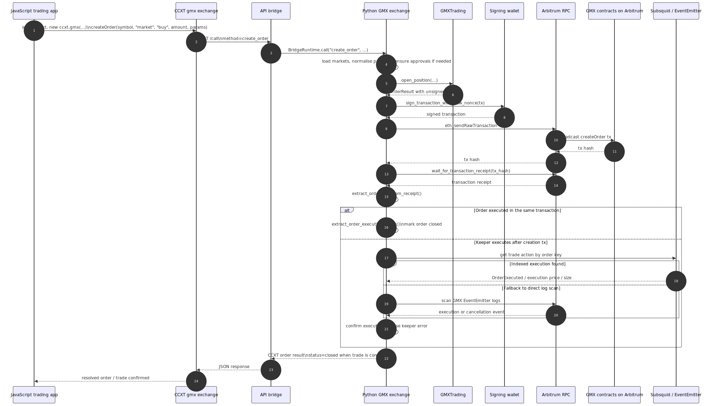

# Architecture

This repository exposes the Python GMX CCXT implementation over HTTP and reconnects it to an in-repo CCXT `gmx` adapter.

## Overview

Mermaid source: [architecture.mmd](images/architecture.mmd)

This overview keeps the top-level shape small:

- The left-hand `CCXT` block groups the external CCXT client and the repo's `gmx` CCXT exchange class in [gmx.ts](../ccxt/ts/src/gmx.ts).
- The middle `API bridge` block is the `GMX CCXT Middleware Server`, implemented in [__main__.py](../src/gmx_ccxt_server/__main__.py), [app.py](../src/gmx_ccxt_server/app.py), [runtime.py](../src/gmx_ccxt_server/runtime.py), and [config.py](../src/gmx_ccxt_server/config.py).
- The right-hand `Arbitrum and GMX` block groups the external RPC connection and the other GMX API services used by the Python GMX engine in [exchange.py](../web3-ethereum-defi/eth_defi/gmx/ccxt/exchange.py).

## Middleware Server Detail

Mermaid source: [architecture-bridge-detail.mmd](images/architecture-bridge-detail.mmd)

This chart focuses on the `GMX CCXT Middleware Server` internals:

- The server entrypoint is [__main__.py](../src/gmx_ccxt_server/__main__.py), which starts Uvicorn and builds the app.
- The FastAPI app wiring is in [app.py](../src/gmx_ccxt_server/app.py), while the public endpoints live in [ping.py](../src/gmx_ccxt_server/routes/ping.py), [describe.py](../src/gmx_ccxt_server/routes/describe.py), and [call.py](../src/gmx_ccxt_server/routes/call.py).
- Runtime orchestration is in [runtime.py](../src/gmx_ccxt_server/runtime.py), where `BridgeRuntime` enforces the method allow-list and serialises exchange calls.
- Config loading is in [config.py](../src/gmx_ccxt_server/config.py), which maps `GMX_*` environment variables into the Python GMX exchange parameters.

## Python GMX Detail

Mermaid source: [architecture-engine-detail.mmd](images/architecture-engine-detail.mmd)

This chart focuses on the main Python GMX classes:

- The main exchange object is `GMX` in [exchange.py](../web3-ethereum-defi/eth_defi/gmx/ccxt/exchange.py).
- Configuration and Web3 context live in `GMXConfig` in [config.py](../web3-ethereum-defi/eth_defi/gmx/config.py).
- Trading flows live in `GMXTrading` in [trading.py](../web3-ethereum-defi/eth_defi/gmx/trading.py).
- Read-side market queries live in `GMXMarketData` in [data.py](../web3-ethereum-defi/eth_defi/gmx/data.py).
- REST and GraphQL integrations live in `GMXAPI` in [api.py](../web3-ethereum-defi/eth_defi/gmx/api.py) and `GMXSubsquidClient` in [graphql/client.py](../web3-ethereum-defi/eth_defi/gmx/graphql/client.py).
- The composed client view lives in `GMXClient` in [base.py](../web3-ethereum-defi/eth_defi/gmx/base.py).
- Optional vault-based signing uses `LagoonGMXTradingWallet` in [lagoon/wallet.py](../web3-ethereum-defi/eth_defi/gmx/lagoon/wallet.py).

## External Integrations

Mermaid source: [architecture-external-integrations.mmd](images/architecture-external-integrations.mmd)

This chart focuses on out-of-repo dependencies:

- Arbitrum RPC is configured through `GMX_RPC_URL`. In GMX terms this is how the `GMX CCXT Middleware Server` reaches the on-chain protocol contracts documented in the official [GMX Contracts docs](https://docs.gmx.io/docs/api/contracts/).
- Optional signing state comes from `GMX_PRIVATE_KEY`, `GMX_WALLET_ADDRESS` in read-only mode, or an injected wallet object. Signed transactions are submitted against the GMX contract surface described in the official [GMX Contracts docs](https://docs.gmx.io/docs/api/contracts/).
- The GMX Subsquid indexer domain is `gmx.squids.live`. The official endpoint list and network mapping are in the [GMX Subsquid docs](https://docs.gmx.io/docs/api/subsquid/).
- The GMX REST API v1 domains in the codebase are `arbitrum-api.gmxinfra.io`, `arbitrum-api.gmxinfra2.io`, `arbitrum-api-fallback.gmxinfra.io`, and `arbitrum-api-fallback.gmxinfra2.io`. These correspond to the official [GMX REST API docs](https://docs.gmx.io/docs/api/rest/).
- The GMX REST API v2 Arbitrum domain in the codebase is `gmx-api-arbitrum-2nlbk.ondigitalocean.app`. The `eth_defi` source uses it for the newer REST surfaces alongside the official [GMX REST API docs](https://docs.gmx.io/docs/api/rest/).
- The optional contracts registry refresh URL is served from `raw.githubusercontent.com`, but the authoritative protocol-facing documentation for the on-chain components remains the [GMX Contracts docs](https://docs.gmx.io/docs/api/contracts/).

## Trade Request Flow

Mermaid source: [architecture-open-position-sequence.mmd](images/architecture-open-position-sequence.mmd)

This sequence starts from a JavaScript trading app that imports CCXT and configures `ccxt.gmx`, then follows an open-position call all the way through broadcast and confirmation:

- The JavaScript side uses the repo's `gmx` CCXT exchange class in [gmx.ts](../ccxt/ts/src/gmx.ts), which sends `create_order` to the `GMX CCXT Middleware Server` HTTP contract.
- The `GMX CCXT Middleware Server` dispatches to `BridgeRuntime` in [runtime.py](../src/gmx_ccxt_server/runtime.py), which calls the Python `GMX` exchange in [exchange.py](../web3-ethereum-defi/eth_defi/gmx/ccxt/exchange.py).
- The Python GMX code builds an unsigned order transaction through `GMXTrading` in [trading.py](../web3-ethereum-defi/eth_defi/gmx/trading.py) and the order classes in [base_order.py](../web3-ethereum-defi/eth_defi/gmx/order/base_order.py).
- The transaction is signed, broadcast to Arbitrum through RPC, and the Python CCXT code waits for the transaction receipt.
- After receipt retrieval, the Python CCXT code extracts the GMX `order_key` and confirms the trade either from the same receipt or by waiting for keeper execution through Subsquid or direct EventEmitter log scanning before returning a closed order to the JavaScript caller.

### Order execution in the same transaction

Some orders are fully resolved by the time the initial transaction receipt comes back. In the Python CCXT flow this is the `immediate_execution` branch in [exchange.py](../web3-ethereum-defi/eth_defi/gmx/ccxt/exchange.py), where the code reads the same receipt, extracts the execution result, and can immediately return a closed order to the caller.

In this path:

- the JavaScript app submits one CCXT `createOrder(...)` call
- the `GMX CCXT Middleware Server` forwards it to the Python GMX exchange
- the signed transaction is broadcast through Arbitrum RPC
- the receipt already contains enough GMX execution data for Python to confirm the trade
- the `GMX CCXT Middleware Server` returns a confirmed result without needing to poll the indexer

This is the simpler flow because the write and the confirmation happen off the same transaction receipt.

### Order executed by keeper

GMX uses a keeper-based execution model for many orders. GMX's own Trading docs describe this as a two-transaction flow: the user first submits the request, then a keeper observes the request and executes it later. See the official [GMX Trading docs](https://docs.gmx.io/docs/trading/) and the operational timing notes in the [GMX API Integration guide](https://docs.gmx.io/docs/api/integration-guide/).

A keeper is an off-chain actor or service that watches for pending GMX orders and sends the follow-up execution transaction to the protocol. In practice, that means the user's transaction can succeed on-chain, but the actual trade execution may still happen afterwards in a separate keeper transaction.

In this path:

- the JavaScript app still makes one `createOrder(...)` call
- Python broadcasts the initial order-creation transaction and waits for its receipt
- Python extracts the GMX `order_key` from that receipt
- Python then waits for evidence that the keeper has executed the order
- it first checks indexed data through Subsquid, and if needed falls back to scanning GMX EventEmitter logs via RPC
- only once execution is confirmed does the Python CCXT code return a closed trade result

The important difference is timing:

- same-transaction execution means receipt retrieval is enough to confirm the trade
- keeper execution means receipt retrieval only confirms order creation, so Python must do an extra confirmation step before treating the trade as done

### Execution buffer

`execution_buffer` is the fee safety multiplier that the `GMX CCXT Middleware Server` passes into the Python GMX order-building code. In this repo it defaults to `2.2` through the environment-backed server config in [config.py](../src/gmx_ccxt_server/config.py), and is then used by the `eth_defi` GMX code when calculating the execution fee for an order.

The relevant behaviour is implemented in [gas_utils.py](../web3-ethereum-defi/eth_defi/gmx/gas_utils.py): the base execution fee is multiplied by `execution_buffer` so the order includes enough execution fee for GMX keepers to execute it profitably even if gas conditions worsen. The same module warns that low values make keeper rejection more likely, and notes that any excess execution fee is refunded by GMX.

Operationally:

- a higher `execution_buffer` makes execution more robust during gas spikes
- a lower `execution_buffer` increases the chance of `InsufficientExecutionFee`-style failures or keeper cancellations
- the setting matters most in the keeper-executed flow, because that is where an external executor must later pick up and execute the order
